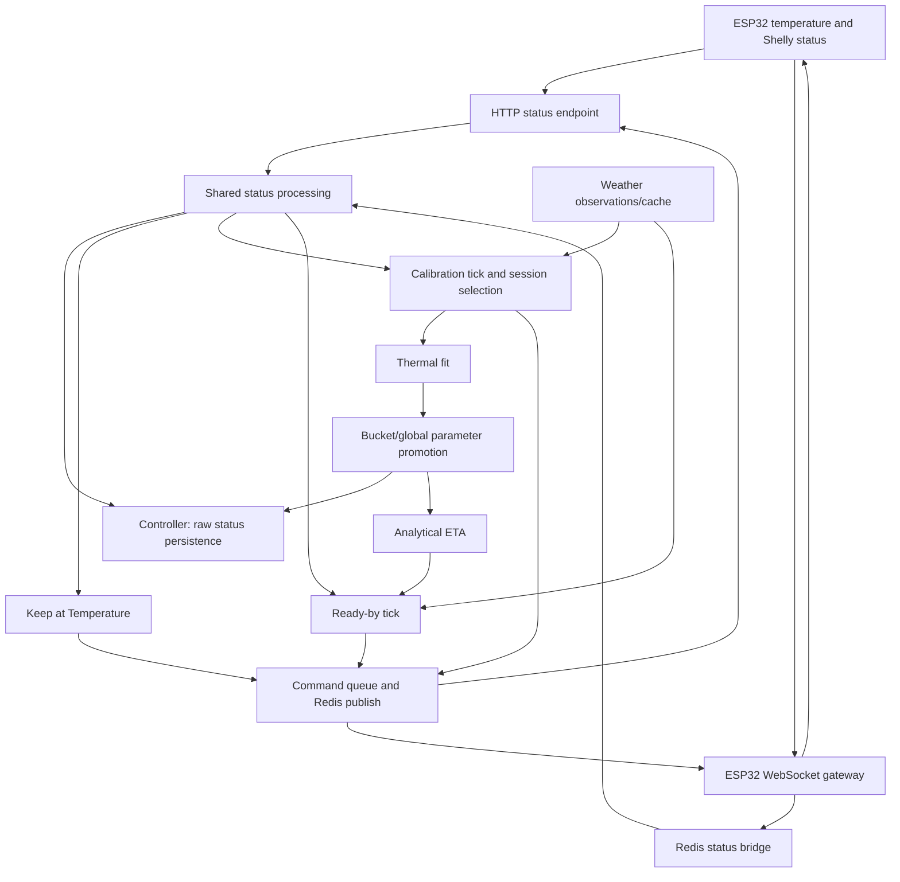

# Car Heater Physics and Control Audit

## Executive Summary

**Recommendation: B — retain the first-order thermal model, but substantially
refactor calibration and control after addressing the confirmed defects.** A full
rewrite is not justified by the evidence. The model's energy balance, exponential
solution and analytical heating time are mathematically and dimensionally correct
within their stated assumptions. The surrounding implementation does not reliably
preserve those assumptions or the semantics of its inputs.

The most consequential results are:

- **Ready-by starts immediately when an off heater reports zero power.** It uses
  present consumption to predict future heating, declares the target unreachable,
  and invokes its deliberate start-now fallback. With a deadline three hours away,
  the real service starts at 0 W but waits with a 46.14-minute ETA at nominal power.
- **Calibration and prediction can use different model configurations until
  restart.** Updating configuration replaces the prediction physics object but
  leaves session fitting attached to the old one.
- **A good-looking fit is not proof of correct parameters or useful ETA.** The
  optimizer misses known noiseless solutions; acceptance can admit negative R²;
  promotion can bypass intended smoothing; bucket selection changes after restart.
- **Cancellation can lose an explicitly requested OFF command** during Ready-by's
  command cooldown. Missing weather also prevents already-reached target detection.
- **Existing automated tests mostly protect persistence and transport.** The
  focused suites pass (84 tests), but they do not establish physical accuracy,
  parameter recovery, or successful scheduling through the real model.

This is an investigation of revision `b95b30a`, performed on 2026-09-29. Production
code was not changed. Tests used isolated databases; experiments used synthetic
observations and fake command/persistence dependencies, without live devices,
webhooks or production databases. No representative historical car-heater dataset
was found in the repository files inspected. Physical field accuracy remains
**unverified**, not disproved.

Severity below describes likely consequence; confidence describes strength of
evidence. A code-path defect can be high-confidence without evidence of how often
it occurs in the deployed installation. Code references are repository-relative,
with line numbers at the audited revision.

## Intended Behaviour

The subsystem should let a user heat a parked car to a selected cabin sensor
reading by a departure time, then maintain that reading with hysteresis.
Calibration observes heating sessions, estimates effective heat-loss and input
coefficients, and selects parameters for outside temperature/wind conditions.
Optional autonomous calibration actively starts heating when no conflicting mode
needs the heater. Disabling autonomous calibration does **not** disable passive
observation.

Ready-by estimates remaining heating time, subtracts it from the deadline, starts
when necessary, and records whether target attainment was early or late. Its
unreachable-target policy deliberately starts immediately for best-effort warming.
On success it enables Keep at Temperature and persists `completed`; it does not
turn the heater on again in the same tick. Keep at Temperature then switches below
`target - hysteresis/2` and above `target + hysteresis/2`.

The intended controlled quantity is the reported cabin temperature. There is no
implemented model of windshield frost, glass temperature, moisture removal, seat
comfort, battery warming or uniform occupant comfort. Calling the vehicle “ready”
for those outcomes would require additional evidence and a clearer contract.

### Intent reconstructed from history

| Commit | Evidence and interpretation |
| --- | --- |
| `a387f9f` (2026-01-24) | Introduced thermal calibration, persistence, quality gates and ETA. This was intended as an adaptive predictive controller, not merely a timer. |
| `f1bcc54` (2026-01-24) | Added `mass_factor`, outside-temperature smoothing, curvature gating and priors; explicitly recognized that air-only capacity is too small. These are deliberate engineering safeguards, although their numerical settings are not validated by that commit. |
| `47bf64c`, `13aca54` (2026-01-24) | Added Ready-by, including start-now for unreachable targets, then schedule persistence. Preserve the intent while correcting the input classification. |
| `2c86724` (2026-01-25) | Extracted the kFactor package. The previous predictor used a truthiness fallback for zero power; the extracted predictor preserves finite zero. Current simulation still substitutes nominal power. This is evidence of a semantic regression during extraction, not evidence that real zero draw is nominal consumption. |
| `be1f120`, `db8196f`, `a5b1a75` (2026-01-26) | Restored passive observation/power fallback, bucket selection, prediction-outcome support and separate cooldowns. Preserve their purposes rather than deleting them as apparent complexity. |
| `b68c1af` (2026-01-28) | Distinguished autonomous duration and informativeness thresholds, acknowledging different session lengths. |
| `ab0fb21` (2026-02-05), `d063ede`, `6e70bdf` (2026-06-12) | Added Redis/ESP32 transport and later maintenance/security changes. Current shared status processing is important behavior to retain. |

The feature contracts in `docs/development/feature-contracts.md:8–27` require
shared HTTP/WS side effects, normalized status, queued versus executed command
stages, completion handoff, synchronized model configuration and PostgreSQL
sequence recovery. Some contracts describe intended behavior that the current
implementation does not completely satisfy; comments alone were not accepted as
proof.

## System/Data Flow



`status.py:509–600` is the shared processing path;
`esp32_redis_bridge.py:158–190` calls it with database persistence enabled and
`commands_enabled=False`. That flag prevents draining the HTTP command queue;
it does **not** disable automation. Valid Shelly data is persisted, then Keep at
Temperature, calibration and Ready-by run in that order. Charge-mode state is
processed subsequently. With missing/disconnected Shelly data, the fallback status
is displayed but these three control ticks do not run.

| Input | Source → normalization → storage → model/control |
| --- | --- |
| Cabin temperature | ESP payload `temperature` → `CarHeaterStatus.ambient_temp` → Controller status row → Ready-by finite-value check; calibration receives `float(ambient_temp or 0)`, which converts missing data to a fabricated 0°C. |
| Relay state | Shelly `output` → boolean `is_heater_on` → status row → session selection and command decisions. Relay enabled is not proof of heat production. |
| Power | Shelly `apower` → `instant_power_w` (missing key defaults to 0) → float in persistence → calibration replaces missing/≤1 W with 1000 W; Ready-by/ETA preserve finite zero. |
| Outside temperature | FMI weather `t2m.value` → finite value → session summary mean/min/max, not a replayable raw outside series → fitting uses per-sample values and trailing smoothing. Ready-by can take payload `outside_temp`, otherwise weather. |
| Wind | FMI `ws_10min.value` → finite value → session mean/bucket → parameter selection only; no explicit wind term in the ODE. Payload wind is not forwarded by shared calibration wiring. |
| Measurement time | Payload UTC string → Helsinki-aware datetime → status persistence/Ready-by evaluation. Shared calibration call omits that timestamp and uses receipt-time wall clock. |
| Thermal capacity | Constants `1.2 × 2.8 × 1000`, multiplied by bounded configured `mass_factor` → not fitted → simulation and ETA, potentially with different config objects after an update. |
| `k_loss`, `eta` | Defaults, accepted fit, in-memory overrides or Controller bucket/global records → selection priority → ETA and new fit initialization. Selection can replace explicitly supplied outside temperature when wind is omitted. |
| Deadline/target | Browser HTTP/socket request → ReadyBySchedule → persisted JSON → status-driven evaluation, not an independent timer. |

Shelly defines `apower` as measured instantaneous active power delivered to the
load, and `output` as relay state. It is not a rating or a forecast of draw after
switch-on. See [Shelly Switch documentation](https://shelly-api-docs.shelly.cloud/gen2/ComponentsAndServices/Switch/).

Relevant persistence is in `app/core/_controller/car_heater.py`,
`car_heater_kfactor.py` and `car_heater_ready_by.py`, using SQLAlchemy Core and
`self._sa_engine`. Stored calibration sessions/results summarize fits; the
in-memory sample history is not a complete durable training dataset. Controllers
preserve power rather than inferring future powered-on consumption. The DTO and
schema also contain prediction-outcome fields, but repository-wide call searches
found no runtime caller of `KFactorCalibrator.record_prediction_outcome()`.

Commands go through `CarHeaterService.turn_on/turn_off` and are both queued and
published to Redis (`car_heater_service.py:93–150`). Queueing and acknowledgement
are distinct from measured relay/power state. This is a useful separation, but
there is no single control decision that arbitrates all competing modes.

## Thermal Model

### Quantities and units

| Symbol | Code name | Unit and interpretation |
| --- | --- | --- |
| T | `cabin_temp_c` | °C, the measured cabin/sensor state, assumed representative of one effective thermal node |
| To | `outside_temp_c` | °C, exterior thermal reservoir; differences in °C equal differences in K |
| T* | `target_temp_c` | °C, requested sensor target |
| t, Δt | datetime differences | seconds; returned ETA divides by 60 for minutes |
| P | `power_w` | W = J/s, electrical input attributed to cabin heating |
| η | `eta` | Dimensionless effective fraction of electrical input entering the modeled node |
| k | `k_loss_W_per_K` | W/K, aggregate effective conductance to outside; not a material conductivity in W/(m·K) |
| C | effective heat capacity | J/K, energy required per degree of modeled-node change |
| m | `mass_factor` | Dimensionless capacity multiplier, not a mass in kilograms |
| ρ, V, cp | fixed constants | kg/m³, m³, J/(kg·K), respectively |
| τ | C/k | seconds, thermal time constant |
| T∞ | `Tss` | °C, equilibrium under constant input and outside conditions |
| δ | `margin_c` | K, a 0.5°C application reachability buffer |

The implementation uses

\[
C_{air}=\rho Vc_p=(1.2)(2.8)(1000)=3360\;\mathrm{J/K},\qquad
C=C_{air}\,\operatorname{clamp}(m,5,150).
\]

Units reduce as `(kg/m³) × m³ × J/(kg·K) = J/K`; default `m=30` gives
**100,800 J/K**. The configured range corresponds to 16,800–504,000 J/K, not a
measured confidence interval. Density, specific heat and volume are approximations;
the multiplier is empirical. The default `k=40`, `η=0.6`, `P=1000` gives
**τ=2520 s=42 min** and **T∞−To=15 K**.

### Energy balance and derivation

The code represents

\[
C\frac{dT}{dt}=\eta P-k(T-T_o).
\]

Both sides have units J/s: `(J/K)(K/s) = W`, `ηP = W`, and `(W/K)K = W`.
The energy balance is physical law; linear loss and a single constant capacity
are engineering approximations. Validity requires the measured state to behave
like one node, heat input to be assigned consistently, and omitted heat flows to
be negligible or captured adequately by effective coefficients.

For constant P, To, η, k and C, define

\[
T_\infty=T_o+\frac{\eta P}{k},\qquad \tau=\frac{C}{k}.
\]

Setting `dT/dt=0` produces T∞. For `x=T−T∞`, the balance becomes
`dx/dt=−x/τ`; separation and the initial condition give

\[
T(t)=T_\infty+(T_0-T_\infty)e^{-t/\tau}.
\]

Differentiation yields `C dT/dt = −k(T−T∞) = ηP−k(T−To)`, and at `t=0`
the solution equals T0. Thus the implementation is verified by substitution,
not merely by resemblance to an exponential.

`physics.py:33–78` applies this exact solution on each interval with the previous
sample's power and outside temperature:

\[
T_i=T_{\infty,i-1}+(T_{i-1}-T_{\infty,i-1})
\exp[-k\Delta t_i/C].
\]

The exponent is dimensionless: `(W/K)/(J/K) × s = 1`. This is exact for
piecewise-constant forcing, not necessarily exact for a changing real heater
between sparse measurements. Nonpositive time intervals repeat the previous
modeled temperature rather than rejecting the series.

For varying conditions, the same linear model has the integrating-factor form

\[
T(t)=e^{-at}T_0+\int_0^t e^{-a(t-u)}[bP(u)+aT_o(u)]\,du,
\quad a=k/C\;[s^{-1}],\quad b=\eta/C\;[K/J].
\]

The integral has units K because the bracket is K/s. The implementation
approximates these forcing functions with sampled, held values. Predicting into
the future instead holds current conditions constant.

### Time to target

For `T0 < T* < T∞`, inversion gives

\[
\frac{T^*-T_\infty}{T_0-T_\infty}=e^{-kt/C},\qquad
 t=-\frac{C}{k}\ln\left(\frac{T^*-T_\infty}{T_0-T_\infty}\right).
\]

The ratio is dimensionless and strictly between zero and one, so the logarithm
is negative and t is positive seconds. `physics.py:330–374` implements this
formula correctly and returns `t/60`. Reached targets return zero. It additionally
returns `None` when `T* >= T∞−0.5°C`: that is a conservative application heuristic,
not the mathematical reachability boundary.

The equation predicts **continued heating from the current state**. Planning
heating while the relay is off requires an estimate of **future powered-on P**.
The analytical formula cannot infer that estimate from an off-state measurement.

### Limiting cases

| Case | Physical/model limit | Current behavior and assessment |
| --- | --- | --- |
| P → 0 | T∞ → To; cabin relaxes toward outside. Heating from below To may still occur naturally. | ETA permits finite zero; simulation jumps to 1000 W at P≤1. The simulator is unsuitable for true zero-input/cooling trajectories without changing its power contract. |
| k → 0 with ηP>0 | `T=T0+ηPt/C`; `t=C(T*−T0)/(ηP)`. | k≤0 rejected. Positive very small k uses subtraction of large equilibrium values, inviting cancellation. Configured k≥10 avoids the usual runtime limit, but the generic model lacks the zero-loss branch. |
| T0=To | Initial slope ηP/C, with no initial linear heat loss. | Correct for valid positive input; defaults give 0.3571 K/min. |
| T*≤T0 | Heating objective already met; zero remaining heating time. | Correct zero return, not a cooling-time prediction. |
| T*→T∞ from below | ETA → infinity. | Correct formula away from cutoff; returns None throughout final 0.5 K. At To=T0=−10, defaults, T*=4.6, exact ETA≈152.22 min but code says unreachable. |
| Very cold To | Reachable ceiling shifts down by the same temperature change at fixed parameters. | Correct algebra; constant-coefficient extrapolation may be inaccurate. Defaults at −20°C imply a −5°C ceiling, so +10°C cannot be reached under those defaults. |
| Low/high η | Input and equilibrium rise scale with η. η=0 removes heater heat. | Configured fit range .05–1 excludes zero; no independent evidence validates these bounds for an effective sensor model. |
| Low/high k | More loss lowers equilibrium and shortens τ; it does not mean useful targets heat sooner. | Correct dependence. ETA monotonicity in loss requires conditions such as T≥To; below outside, stronger coupling can accelerate warming. |
| Short/long Δt | Small-step increment tends to `[ηP−k(T−To)]Δt/C`; long step approaches T∞. | Exponential update is stable for positive k,C; missing within-step power changes remain a sampling error, not numerical instability. |

## Physics Validation

The following judgments separate the equation from its empirical suitability.
The derivations above and synthetic checks are this audit's calculations.

| Assumption/equation | Judgment | Reason |
| --- | --- | --- |
| Energy conservation and units | **Valid** | The balance is dimensionally consistent, with heat stored equal to net heat input. |
| Analytical solution and inverse | **Valid** | Verified by substitution and numerical round trips under constant conditions. |
| Linear conductance to one ambient reservoir | **Valid approximation** | Useful locally; conduction, convection and approximately linearized radiation can be combined. It is not a universal vehicle constant. |
| One effective cabin temperature | **Questionable** for unmeasured vehicle accuracy | Sensor, air, seats, dashboard, glass and body need not share a temperature or time constant. It can still be adequate for predicting one sensor within an agreed tolerance. |
| Air capacity × empirical multiplier | **Valid approximation** as a fitted lumped scale; **unable to verify** its default value | It represents participating interior heat capacity, not thirty air masses physically occupying the cabin. Participation can vary with heating duration and initial soak. |
| η as true electrical conversion efficiency | **Questionable** | For resistive heating, electrical conversion to local heat is essentially complete; an effective η also absorbs heat routing, load attribution, sensor bias and model error. It is not identified independently of assumed capacity. |
| Fixed nominal 1000 W | **Unable to verify** as a rating; **incorrect** as a replacement for known zero draw during fitting | A configured fallback may support missing data, but zero is an observation. A thermostat-open or disconnected heater does not deliver 1000 W. |
| Wind/air exchange represented by k | **Valid approximation**, unvalidated coefficients | Infiltration adds approximately `ṁ cp(T−To)` loss, giving `k_infiltration=ṁ cp` in W/K. Wind can change air exchange and external convection; a weather-station bucket is an imperfect proxy. |
| Outside temperature constant during ETA | **Valid approximation** over sufficiently stable forecast intervals | No forecast is integrated; station observations may differ from the car's microclimate. Long ETA and near-equilibrium predictions are more sensitive. |
| Piecewise measured power | **Valid approximation** when sampling resolves changes | Instantaneous readings can alias internal heater cycling. Interval energy or adequately sampled power would establish actual delivered energy. |
| Constant C, k, η across a session | **Questionable** at large temperature ranges/changed conditions | Heat-transfer coefficients, coupling to interior solids and airflow can change. No residual analysis establishes adequacy. |
| 0.5°C reachability margin, curvature threshold and score cutoffs | **Application heuristics** | Neither physical laws nor measured uncertainty bounds. They need outcome-based validation. |

A more realistic two-node example would distinguish air/sensor temperature Ta and
interior-mass temperature Tm, with exchange `H(Ta−Tm)` between their balances.
Eliminating Tm generally leaves more than one exponential. This explains why
sensor lag and slow interior warming can bias a one-node fit; it does not prove
that extra state is necessary for this application's deadline tolerance. Solar
loading, door opening, engine residual heat, humidity/phase change and other
loads are also absent. Their deployed importance is unknown.

The source basis for these physical judgments is the
[EnergyPlus zone heat balance](https://raw.githubusercontent.com/NREL/EnergyPlus/develop/doc/engineering-reference/src/integrated-solution-manager/basis-for-the-zone-and-air-system-integration.tex)
for storage/surface/infiltration terms, and its
[hybrid inverse model](https://raw.githubusercontent.com/NREL/EnergyPlus/develop/doc/engineering-reference/src/alternative-modeling-processes/hybrid-model.tex)
for effective mass and equilibrium assumptions. These are authoritative analogues,
not vehicle-specific validation. Sensor response depends on thermal coupling, as
illustrated by the [OMEGA/AD590 manual](https://assets.omega.com/manuals/test-and-measurement-equipment/temperature/sensors/solid-state-sensors/M0287.pdf);
the installed sensor is unknown. Radiation's fourth-power dependence uses absolute
kelvin temperatures, unlike the linear differences in this model; see
[NASA's radiation laws](https://asd.gsfc.nasa.gov/archive/mwmw/mmw_bbody.html).
Resistance heating's conversion of electrical energy to heat does not establish
how much heats the modeled cabin node; see the
[Australian Government heating explanation](https://www.energy.gov.au/households/heating-and-cooling).

## Calibration Analysis

### What can actually be identified?

Rewrite the balance as `dT/dt = bP − a(T−To)`, with `a=k/C` and `b=η/C`.
Temperature observations can identify these two ratios when the input/temperature
trajectory is sufficiently informative. If capacity is unknown, the transformation

\[
(C,k,\eta)\longmapsto(sC,sk,s\eta),\quad s>0
\]

preserves every trajectory for every power/outside-temperature history, provided
the transformed parameters remain within allowed bounds. Therefore this dataset
cannot uniquely determine all three physical quantities. Priors, buckets and a
smaller search grid cannot remove that structural ambiguity.

The implementation fixes C through `mass_factor`; it does not estimate mass.
With known fixed C, a sufficiently curved, noiseless heating transient can identify
k and η. From an ambient start with constant input, the initial slope is `ηP/C`
and the exponential rate is `k/C`. Short early traces predominantly establish the
former, leaving k weakly constrained. A near-steady trace alone predominantly
establishes `ηP/k`. Cooling traces would help estimate `k/C`, but are discarded.
Even adding cooling cannot independently identify unknown C and η without an
additional measurement or assumption.

A wrong fixed capacity does not necessarily ruin predictions: if truth is
`C=201600, k=40, η=.6`, an assumed `C=100800, k=20, η=.3` gives **identical**
trajectories. It does make interpreting fitted k and η as independently measured
physical properties unjustified. Bounds can exclude that equivalent solution, and
the present optimizer can miss it even when it exists.

### Lifecycle, selection and rejection

`calibrator.py:612–1063` handles observation and actuation;
`session.py:162–603` owns samples, rejection, fitting and promotion.

1. **Passive observation:** runs even with autonomous mode disabled. Three
   heater-on observations are required before starting; recording begins at the
   last grace observation, losing the initial segment. A session ends on observed
   off, disturbance or the default 120-minute limit.
2. **Autonomous operation:** the default is disabled. When enabled, window and
   conflict checks lead from IDLE to ARMED, then an ON command and a recording
   session. The initial sample is marked heater-on before confirmation. Missing
   acknowledgement/delayed relay operation can therefore contaminate the first
   interval. Conflicts include running Ready-by, a scheduled deadline within two
   hours, enabled thermostat and charge mode.
3. **Autonomous stopping:** disturbance, target 10°C after more than eight minutes,
   sustained rise slower than .08°C/min, 45-minute maximum, or unexpected relay-off.
   Slow-rise decisions use five samples and three checks, so their wall-clock
   sensitivity changes with reporting cadence. Window/conflict checks are not
   repeated in the recording branch. An eight-minute target stop can precede the
   separate ten-minute informativeness threshold; this wastes a calibration run,
   rather than proving its measurements are invalid.
4. **Disturbance checks:** after at least three samples, a ≥5°C adjacent jump
   aborts. Two drops exceeding .5°C in the first five minutes abort. After five
   minutes, maximum rise below .5°C aborts. These are useful heuristics but do not
   detect all solar gain, door openings, late cooling, sensor bias or gaps.
5. **Informativeness:** requires ≥20 minutes passive or ≥10 autonomous, ≥5 on
   samples, and positive early slope. Nearest samples within 120 seconds of the
   one-minute, five-minute, end-minus-five-minute and end points estimate slopes;
   late/early slope must be <.6. Nominal anchor intervals, rather than actual
   selected sample intervals, are used. Negative late slopes pass the curvature
   check, though another gate might reject the session. Variable power/outside
   conditions can imitate curvature unrelated to k.
6. **Acceptance:** minimum duration 15/8 minutes, net rise ≥2°C, no designated
   disturbance flags, informativeness and quality ≥.6. The distinct duration and
   informativeness gates are intentionally additive. At default τ=42 min, an exact
   20-minute trace has slope ratio .708 and is rejected; roughly 27 minutes is
   needed to cross .6. That is a stronger information requirement, not intrinsically
   a bug.
7. **Cooldown and storage:** cooldown is set even for rejected sessions. Defaults
   are 120 minutes passive, 60 autonomous, with a 15-minute no-heating case.
   Autonomous cooldown persists; passive cooldown is in memory. Live samples and
   active recording state do not survive restart. Session summaries, fits, config,
   bucket/global parameters and last-session diagnostics do.

### Fitting, metrics and priors

`physics.py:133–318` filters out heater-off samples, fixes the initial state at the
first observed temperature and smooths outside temperature with a trailing
three-sample average. Sample spacing changes the smoothing time horizon. Residuals
are weighted per observation, so dense reporting periods count more than sparse
ones. Missing intervals hold the last input; no explicit gap-coverage rule checks
that continuous heating really occurred throughout them.

The fitted objective is based on

\[
\mathrm{RMSE}=\sqrt{\frac1n\sum_i(\hat T_i-T_i)^2}\quad[\mathrm{K}],\qquad
R^2=1-\frac{\sum_i(T_i-\hat T_i)^2}{\sum_i(T_i-\bar T)^2}.
\]

R² is dimensionless, can be negative, and is undefined for a constant observed
trace. Neither is out-of-sample prediction accuracy. Initial residual is zero by
construction. `rmse_for` skips nonfinite pairs and uses zip, so callers must enforce
valid, aligned samples; partial residuals are not a valid substitute for coverage.

The nominal regularized objective is

\[
L=\mathrm{RMSE}+\lambda_k|k-k_0|/|k_0|+\lambda_\eta|\eta-\eta_0|.
\]

The penalties are heuristics; to add them to RMSE their weights implicitly have
temperature units. Defaults are .1. Search first varies k with η fixed, then η with
k fixed, then only ±15% k and ±.15 η around that result. It is neither a converged
joint search nor an uncertainty estimate. Experiments below show large recovery
errors even when true parameters lie inside the allowed range and C is correct.

Joint refinement initializes its incumbent score to bare RMSE but compares trial
scores including priors (`physics.py:287–316`). This is an objective inconsistency.
The η-only phase starts at its η prior, so its initial omitted η penalty is zero;
the consequential mismatch is in joint refinement after k/η have moved. A
high-prior probe isolates this defect; it is distinct from restricted search.

Quality is the unweighted mean of duration, rise, smoothness, informativeness,
continuity and fit scores (`session.py:712–803`). Continuity is assumed to be one.
`fit_score=clamp(1−RMSE/1.5,0,1)`. Thus arbitrarily bad RMSE can still yield quality
5/6=.833, above .6. R² has no acceptance role and stored confidence is `None`.
A negative-R² fit can pass the actual gates; this is not a calibrated confidence
score or a guarantee of useful predictions.

### Promotion and buckets

The intended global update is

\[
\alpha=\operatorname{clamp}(q\,0.3,0.05,0.5),\quad
(k',\eta')=(1-\alpha)(k_{old},\eta_{old})+\alpha(k_{fit},\eta_{fit}).
\]

All weights are dimensionless and the units of k/η are preserved. However,
`session.py:439` writes the raw bucket fit before persistence subsequently
re-reads “old” parameters (`session.py:941`). When the newly written bucket matches
current weather, that read returns the new fit, so the blend becomes the fit with
itself. A mocked-Controller experiment executes actual finalization and confirms
this. Test-mode's precomputed global blend can differ from production behavior.

Temperature and wind buckets round to two-unit increments. Coverage checks recent
accepted sessions within seven days, up to 200 records; missing wind acts as a
wildcard. Parameter lookup itself does not expire old buckets. The in-memory
any-wind fallback uses insertion order, whereas the database uses newest timestamp.
After promotion, the in-memory global override is consulted before database
buckets, hiding other persisted conditions until restart. Also,
`get_active_params()` replaces **both** outside temperature and wind from weather
if either argument is absent; callers supplying outside temperature alone lose it.

Config synchronization has a separate defect: `update_config`, DB refresh and the
enabled setter replace `calibrator._physics`, update `session._cfg`, but never
replace `session._physics`. Fit mass/priors/bounds/smoothing can be old while the
reported config, gates and ETA use new values. Changing mass also changes the
meaning of already stored k/η even after this reference defect is resolved; model
provenance/invalidation requires an explicit policy.

## Prediction and Ready-by Analysis

### Planning with the heater off

`ready_by_service.py:270–288` forwards the DTO's instantaneous power into
`KFactorCalibrator.predict_time_to_target_minutes`, then treats `None` as
unreachable and plans to start now. With relay off, measured zero says nothing
about expected draw after switch-on. There is no rated-power field or learned
powered-on consumption estimate in this path. Missing `apower` also becomes zero
at normalization, whereas explicit `None` reaches the nominal fallback.

This is a confirmed behavioral defect, not just different coding styles between
fitting and prediction. The appropriate direction is separate contracts for
observed interval power, expected future on-power and unavailable measurements.
Blindly substituting 1000 W everywhere would instead conceal real no-power faults.
The prediction HTTP endpoint also falls back to the last stored instantaneous
power (`api/car_heater/kfactor.py:155–168`). In contrast, snapshot live ETA omits
power and therefore assumes nominal input (`snapshot.py:282–301`). The same system
can consequently display different attainability judgments.

### Control and timing

Ready-by continuously recomputes a start time from **current** temperature and
conditions; it does not predict passive cooling before a distant start, weather
changes or heater cycling. Repeated telemetry can correct the plan, but this is
not an optimized future trajectory. Once on, Ready-by does not stop simply because
a revised plan moves later. With a reachable target it waits until target detection
then hands over to the thermostat. The two-minute early/late tolerance records an
outcome; it is not an uncertainty-aware scheduling buffer.

An explicit `cancel(turn_off=True)` sets `canceled`, then applies the shared
30-second command cooldown to OFF. If ON was just sent, OFF is suppressed, and
terminal-state ticks never retry (`ready_by_service.py:184–195, 340–363`). This
violates an explicit request to stop.

Missing outside temperature returns before checking whether the cabin is already
at target. The target handoff needs cabin state, yet weather absence blocks it.
At five minutes after deadline, the service expires before checking target and
issues no OFF command. **Expiry without OFF is confirmed behavior; whether it is
the wrong policy is not documented.** It leaves heater shutdown to another mode,
device behavior or the user. With no telemetry, even expiry cannot run.

Timestamps are mixed: Ready-by evaluates using device measurement time, command
cooldown uses wall clock, and shared calibration uses wall clock. There is no
Ready-by freshness or ordering rejection. Weather observations carry timestamps,
but model callers use values without an age gate. The weather module keeps its
previous cache on fetch failure. Sensor dropout, replayed frames or old weather
can therefore produce apparently current decisions; impact frequency is unknown.

UTC payload parsing and conversion to Helsinki are explicit. Naive schedule times
are assigned Helsinki without validation of nonexistent/ambiguous DST times.
Subtracting datetimes with the same ZoneInfo uses local-time arithmetic across
clock changes. DST scheduling and telemetry replay need dedicated experiments;
this audit does not claim an observed deployment failure there.

### Persistence, ownership and restart

Schedule JSON is normally restored, including last-command metadata, and the next
status tick resumes evaluation. There is no independent schedule timer. Completion
sets terminal status before the thermostat update; if settings are absent or saving
fails, the error is logged but no completion retry follows. Persistence marks the
JSON as last-persisted **before** writing it, so the identical failed state can be
skipped on a retry (`ready_by_service.py:307–337, 442–464`). These are static,
high-confidence failure paths, not observed database outages.

Keep at Temperature, Ready-by and charge mode can all request commands. Only
calibration has explicit conflict checks, and only before autonomous recording.
An existing thermostat target can turn heating off before a different Ready-by
target is reached; charge mode can issue the opposite action later in the same
status processing. Command order is therefore implicit control policy. No complete
multi-mode runtime simulation was performed; classify this as an architecture
concern with demonstrated competing paths, not proven actuator oscillation.

Two additional integration paths deserve preservation and verification:

- Commands are retained in the HTTP queue even after Redis delivery/acknowledgment;
  acknowledgement updates action status, not queue entries. Later HTTP fallback
  can drain old commands (`car_heater_service.py:117–137,184–198,302–314`). Actual
  device replay consequences were not tested; command identity/expiry semantics
  need examination with firmware.
- Charge mode sets `seen_above_threshold` then returns before persistence
  (`car_heater_service.py:275–294`). A restart in that interval loses its arming
  transition and can miss the subsequent low-power cutoff. The code path is
  confirmed; no live battery/charger experiment was run.

## Behavioral Simulations / Experiments

All numbers below come from the current implementation or explicit equations.
No field data was invented. The primary investigator reran the physics,
calibration and control harnesses and inspected their source. Temporary scripts
were kept outside production code. Reproduction recipes below preserve the
important inputs independently of those temporary files.

### E1 — Analytical solution and power semantics

Default capacity/parameters, T0=To=−10°C, 61 samples at one-minute intervals:

| Input P | Simulated T at 60 minutes | ETA to 0°C |
| --- | ---: | ---: |
| 0 W | +1.405234°C | None |
| 1 W | +1.405234°C | None |
| 1000 W | +1.405234°C | 46.141716 min |

A zero-input physical trajectory would remain −10°C in this example. The
simulator's “heating” at zero is its nominal substitution, not integration error.
For 500 randomized reachable constant-condition cases (seed 2, k in 10–150,
η in .1–1, P in 500–2000 W, margin zero), simulation at analytical ETA reached
target within **5.68×10⁻⁹°C**. Datetime microsecond rounding explains the small
residual. This validates consistency of solution and inverse, not real-car physics.
A second set of 500 reachable ambient-start cases (seed 29, k 10–100,
η .1–1, P 500–2000 W, outside −35–0°C, margin zero) verified that a 10%
power increase never lengthened ETA, a 10% loss increase never shortened it,
and doubling capacity doubled ETA within 10⁻⁹ minutes. Targets were chosen
below both equilibria. These conditions matter: loss monotonicity is not asserted
for a cabin colder than outside.

### E2 — Parameter recovery and extrapolation

Default assumed mass 30, initial guess `(40,.6)`, T0=To=−10°C, P=1000 W,
60 minutes, one-minute sampling, no noise unless stated:

| Truth k, η, mass | Returned k, η | RMSE °C | R² | Implication |
| --- | --- | ---: | ---: | --- |
| 40, .6, 30 | 40, .6 | 0 | 1 | Baseline succeeds because truth equals starting guess. |
| 80, .9, 30 | 44.850, .6445 | .6611 | .9499 | Known noiseless solution missed. |
| 15, .3, 30 | 69.5102, .518 | .7421 | .9067 | True ETA to 0°C=77.63 min; fitted target unreachable. |
| 30, .9, 30 | 10, .712 | .8039 | .9804 | True ETA=22.71 min; fitted ETA=25.43 min. |
| 100, .9, 30 | 61.41, .6565 | .5310 | .9501 | True equilibrium −1°C makes target impossible; fit predicts 74.95 min. |
| 40, .6, 60; 120-minute session | 52.2444, .5055 | 1.0604 | .8948 | True ETA=92.28 min; fit says unreachable although equivalent fixed-mass solution `(20,.3)` exists. |
| 100, 1, 5 | 41.32065, .718 | 3.3646 | −2.8856 | Actual quality/acceptance methods still return quality .8333 and accepted. |

Acceptance in the scenario probes means execution of the actual informativeness,
quality and acceptance methods, **not** the entire telemetry/disturbance state
machine. The separate E4 promotion experiment does execute session finalization.
The exact-solution counterexamples isolate optimizer limitations from structural
identifiability. They do not establish how often these parameter sets occur in a
real car.

For the `(30,.9,30)` case, seed 19 Gaussian observation noise σ=.15°C, random
20–100-second intervals, `P(t)=1000+250 sin(t/500)` W and
`To(t)=−10+3 sin(t/900)` °C give `(10,.712)`, RMSE **1.0094°C**, R² **.9702**,
and gate quality **.8878**. Simulation generated observations using left-held
inputs; fitting additionally smoothed outside readings. This is one controlled
stress case, not a noise-sensitivity distribution or an unbiased field benchmark.

### E3 — Real Ready-by and real calibrator

Cabin=outside=−5°C, target=5°C, deadline=now+3 h; only command/settings dependencies
are fakes. Power 0 or 1 W gives `unreachable=True`, `planned_start=now`, `running`
and an immediate ON. Power `None` or 1000 W gives ETA **46.141716 min**, a start
**133.86 minutes later**, `scheduled` and no command.

Immediate `cancel(turn_off=True)` after the zero-power case leaves only ON in the
command log and terminal `canceled`. Separate probes show: an ON heater six minutes
past deadline becomes `expired` without a command; cabin 6°C at target 5°C with no
outside/weather stays `scheduled` without handoff.

### E4 — Configuration, promotion and restart

Updating mass from 30 to 60 gives prediction physics mass 60, session config mass
60, **session fitting physics mass 30**, with different physics-object identities.

Actual `finalize_session` with a mocked Controller, current weather matching the
session, old global `(40,.6)` and accepted raw fit `(10,.712)` saves global
**(10,.712)** with source `weighted_update`. The precomputed α=.273205 would imply
**(31.80385,.63060)**. A different persisted bucket `(80,.9)` is then hidden by the
in-memory global value; a new calibrator against the same fake Controller returns
that persisted bucket. No database/transport uncertainty is needed for either bug.

### E5 — Prior objective consistency

For exact synthetic truth `(80,.9)`, initialize joint refinement at truth, prior
`(40,.6)`, and set both penalty weights to 10. The returned incumbent has RMSE=0
but total objective **13**. Candidate `(68,.75)` has total objective **9.16885**
yet is rejected against the incumbent's bare zero RMSE. This isolates inconsistent
objective evaluation. The large weights are an experimental setting, not defaults.

### Minimal reproduction recipes

From `server/`, save the following to a temporary file and run
`PYTHONPATH=. .venv/bin/python /tmp/car-heater-audit-repro.py`. Imports instantiate
no application or live device client. Commands are captured locally. This
reproduces the central E1–E3 defects and the E4 configuration divergence:

```python
from datetime import datetime, timedelta, UTC
from types import SimpleNamespace
from app.services.car_heater.kfactor import KFactorCalibrator
from app.services.car_heater.kfactor.models import KFactorConfig, KFactorSample
from app.services.car_heater.kfactor.physics import ThermalPhysics
from app.services.car_heater.ready_by_service import ReadyByService
from app.blueprints.api.car_heater.status import build_car_heater_status

now = datetime.now(UTC).replace(microsecond=0)
p = ThermalPhysics(KFactorConfig())
ts = [now + timedelta(minutes=i) for i in range(61)]
for watts in (0, 1, 1000):
    print(watts, p.simulate(ts, -10, [watts] * 61,
          tout=[-10] * 61, k_loss=40, eta=.6)[-1])
y = p.simulate(ts, -10, [1000] * 61, tout=[-10] * 61,
               k_loss=15, eta=.3)
samples = [KFactorSample(t, v, True, 1000, -10)
           for t, v in zip(ts, y)]
print("fit", p.fit_params(samples, 40, .6))

class Commands:
    def __init__(self):
        self.sent = []
    def turn_on(self, **kwargs):
        self.sent.append("ON")
    def turn_off(self, **kwargs):
        self.sent.append("OFF")

class Settings:
    def __init__(self):
        self.value = SimpleNamespace(enabled=False,
            target_temperature_c=None, hysteresis_c=2)
    def get_settings(self):
        return self.value
    def update_settings(self, value):
        self.value = value

k = KFactorCalibrator(ctrl=None, is_test=True)
for watts in (0, None, 1000):
    commands = Commands()
    svc = ReadyByService(car_heater_service=commands,
        kfactor_calibrator=k, keep_at_temp_service=Settings())
    svc.schedule(ready_by_ts=now + timedelta(hours=3), target_temp_c=5)
    car = build_car_heater_status(now,
        {"output": False, "apower": watts}, -5)
    svc.tick(car, outside_temp_c=-5, is_test=True)
    s = svc.get_schedule(as_object=True)
    print(watts, s.status, s.predicted_eta_minutes, commands.sent)
    if watts == 0:
        svc.cancel(turn_off=True)
        print("cancel", s.status, commands.sent)
k.update_config({"mass_factor": 60})
print("capacities", k._physics._cfg.mass_factor,
      k._session._physics._cfg.mass_factor)
```

For the full E2 stress recipe, use `random.Random(19)`, build times by adding
`randint(20,100)` seconds capped at the requested duration, evaluate the P/To
functions above at those times, generate observations with `simulate` using the
true mass, then add independent `rng.gauss(0,.15)` to each observation. Fit with
fresh default configuration and prior `(40,.6)`. Noise is added to observations,
not recursively to the true state. Evaluate synthetic ETA at fixed P=1000,
To=T0=−10, target=0; it is a comparison under those standardized conditions,
not an ETA for the future sinusoidal forcing.

For E4 promotion, use the same one-minute samples with true `(30,.9)`, then:

```python
from unittest.mock import Mock

ctrl = Mock()
ctrl.get_kfactor_config.return_value = None
ctrl.get_kfactor_cooldown.return_value = None
ctrl.get_recent_kfactor_sessions.return_value = []
ctrl.get_kfactor_bucket_params.return_value = None
ctrl.get_kfactor_bucket_params_any_wind.return_value = None
ctrl.get_kfactor_active_params.return_value = SimpleNamespace(
    k_loss_W_per_K=40, eta=.6)
ctrl.record_kfactor_session.return_value = SimpleNamespace(id=1)
k = KFactorCalibrator(ctrl)
k._get_weather = lambda: (-10, 0)
y = p.simulate(ts, -10, [1000] * 61, tout=[-10] * 61,
               k_loss=30, eta=.9)
k._session._session_started_at = ts[0]
k._session._session_samples = [
    KFactorSample(t, v, True, 1000, -10) for t, v in zip(ts, y)]
k._session.finalize_session(end_ts=ts[-1], reason="max_duration",
    is_test=False, set_cooldown_fn=lambda *args: None)
print(ctrl.save_kfactor_active_params.call_args)
ctrl.get_kfactor_bucket_params.return_value = SimpleNamespace(
    k_loss_W_per_K=80, eta=.9)
print("warm", k.get_active_params(outside_temp_c=-20, wind_m_s=2))
print("restart", KFactorCalibrator(ctrl).get_active_params(
    outside_temp_c=-20, wind_m_s=2))
```

These probes intentionally use private seams for diagnosis; they are not proposed
production interfaces or a new test-suite implementation.

## Test Coverage Assessment

Executed from `server/`:

```text
.venv/bin/pytest -q tests/test_car_heater.py \
  tests/test_car_heater_kfactor.py tests/test_car_heater_sqla.py \
  tests/test_car_heater_logs_events.py tests/test_ready_by.py
69 passed in 24.55s

.venv/bin/pytest -q tests/test_esp32_api.py tests/test_esp32_ws_manager.py
15 passed in 0.98s
```

| Test class | What exists / what it proves | What it does not prove |
| --- | --- | --- |
| Persistence | `test_car_heater_kfactor.py`: sessions, results, active/bucket params, config, cooldown, stats, joins and PostgreSQL sequence retry; `test_ready_by.py`: JSON config/state/upserts/migration; `test_car_heater_sqla.py`: status/settings persistence | Whether stored parameters represent physics, whether loaded state produces correct commands, or runtime config propagation |
| Orchestration | `test_ready_by_completion_enables_keep_at_temp_without_turning_heater_on` exercises actual service completion/handoff | ETA is a stub returning ten minutes; no real model input semantics or off-state planning |
| Transport/logging | HTTP/Redis browser payloads, log handling and ESP32 API/manager behavior | Bridge status tests omit Shelly and runtime services, so do not enter thermal/control ticks |
| Physics/model | Interactive simulator in `tests/test_car_heater.py`; audit-only round trips | No automated numerical invariant suite or external physical validation |
| Calibration | Controller persistence tests; audit-only recovery/gate/promotion probes | No automated recovery, uncertainty, rejected-fit, config-reload or promotion-behavior regression suite |
| Behavioral/control | One completion regression; audit-only Ready-by harness | Cancellation cooldown, missing weather, expiry policy, stale data, mode conflicts, delayed acknowledgement and restart failures |
| End to end | No reviewed automated test combines real ingress, real thermal prediction, scheduling, command observation and subsequent completion | Hardware attainment, transport failover, energy cost, held-out ETA accuracy |

The interactive simulation explicitly promises fast synthetic timestamps and
weather overrides (`tests/test_car_heater.py:359–366`), but shared calibration
wiring discards them. It also adds temperature noise recursively to its simulated
state, rather than solely to observations. It is not a statistical parameter
recovery regression. It was **not run against an application**: test status still
executes real control ticks, and the wrapper does not pass `is_test` into
calibration. Skipping raw-status persistence does not isolate all side effects.

Passing tests therefore support existing persistence/transport contracts but do
not counter the demonstrated numerical and behavioral failures. The full repository
suite was not necessary for a documentation-only change; no production behavior
was modified. No browser interaction or live device operation was used as evidence.

## Findings

### F01 — Current consumption is used to plan future heating

- **Category / severity / confidence:** Confirmed defect; High; High.
- **Affected modules:** `api/car_heater/status.py:204–207`, `ready_by_service.py:270–288,315–321`, `kfactor/calibrator.py:1309–1333`, `kfactor/physics.py:338–374`.
- **Observed / expected:** OFF at 0 W produces immediate ON; future planning should use an explicitly justified powered-on input estimate.
- **Evidence:** E1/E3 with real DTO construction, calibrator and scheduler; Shelly field definition.
- **Consequence:** Heating can start hours early and consume energy maintaining temperature; unattainability is falsely reported.
- **Proposed direction:** Distinguish observed power, expected heating power, unknown measurement and confirmed zero; make ETA consumers use the same documented meaning.

### F02 — Fitting retains stale physics after configuration changes

- **Category / severity / confidence:** Confirmed defect; High; High.
- **Affected modules:** `kfactor/calibrator.py:158–162,182–192,265–296`, `kfactor/session.py:55,386–388`.
- **Observed / expected:** Session physics retains startup config while ETA uses replacement config; all calculations for a model version should share one coherent parameter/capacity definition.
- **Evidence:** E4 shows mass 60 for prediction and 30 for fit after one update.
- **Consequence:** Calibration can optimize a different model than the one controlling readiness; restart changes behavior.
- **Proposed direction:** Establish one configuration lifecycle and explicit provenance for fitted parameters; verify update and reload through the public seam.

### F03 — Search misses exact, identifiable parameter solutions

- **Category / severity / confidence:** Calibration weakness; High; High.
- **Affected modules:** `kfactor/physics.py:160–185,196–318`.
- **Observed / expected:** One coordinate pass and narrow joint search return substantially wrong parameters for noiseless in-model observations; an estimator should recover identifiable known cases within stated tolerances.
- **Evidence:** E2: true `(15,.3)` becomes `(69.51,.518)` and reverses attainability. E5 separately proves inconsistent incumbent objective evaluation.
- **Consequence:** High R² can coexist with false reachable/unreachable predictions.
- **Proposed direction:** Evaluate the same objective for every candidate and use a bounded fit whose recovery and predictive behavior are verified; quantify uncertainty rather than interpreting a local search result as physical truth.

### F04 — Poor fits pass the quality gate

- **Category / severity / confidence:** Calibration weakness; High; High.
- **Affected modules:** `kfactor/session.py:712–803,584–599`.
- **Observed / expected:** Fit score zero can still yield .833 quality and acceptance; promotion should require adequate predictive fit and informative coverage.
- **Evidence:** E2 actual gate calls accept RMSE3.36°C/R²−2.89; R² is stored but unused. This probe does not claim full tick-lifecycle acceptance.
- **Consequence:** Severe mismatch is not excluded from parameter promotion by existing fit-quality logic.
- **Proposed direction:** Separate hard validity/fit checks from an empirical weighting score and assess held-out prediction error.

### F05 — Promotion can bypass global smoothing

- **Category / severity / confidence:** Confirmed defect; High; High.
- **Affected modules:** `kfactor/session.py:426–445,584–586,904–907,941–960`, `kfactor/calibrator.py:435–447`.
- **Observed / expected:** A newly written bucket is read as the old global value; smoothing should blend against the intended pre-update baseline.
- **Evidence:** E4 actual finalization saves `(10,.712)` instead of `(31.80385,.63060)` when current weather matches the session.
- **Consequence:** A single fit can cause the full parameter jump despite damping settings; test mode can disagree with production.
- **Proposed direction:** Make selection, fitting and promotion use an explicit pre-update snapshot and coherent persistence outcome.

### F06 — Bucket selection depends on process lifetime and missing wind

- **Category / severity / confidence:** Confirmed defect / Integration mismatch; Medium; High.
- **Affected modules:** `kfactor/calibrator.py:406–407,435–469,1325`, `kfactor/session.py:960`.
- **Observed / expected:** Global in-memory override hides stored buckets until restart; missing wind overwrites supplied outside temperature. The same inputs and persisted model should select the same parameters.
- **Evidence:** E4 other-bucket result changes from `(10,.712)` to `(80,.9)` after re-instantiation; source shows both weather arguments replaced on either missing input.
- **Consequence:** Conditions used to select parameters can differ from those used by the ODE, and restarts alter ETA.
- **Proposed direction:** Centralize deterministic selection/fallback/provenance, preserving known input fields and defining parameter age policy.

### F07 — Cancel-and-stop loses OFF during cooldown

- **Category / severity / confidence:** Confirmed defect; High; High.
- **Affected modules:** `ready_by_service.py:184–195,221–222,340–363`.
- **Observed / expected:** Cancel immediately after ON marks canceled but suppresses requested OFF; explicit stop should result in delivery or a durable retryable intention.
- **Evidence:** E3 command log contains ON only after `cancel(turn_off=True)`.
- **Consequence:** User-requested stopping is not performed by Ready-by.
- **Proposed direction:** Distinguish duplicate-command throttling from a change in desired state, and verify cancellation under delayed execution.

### F08 — Missing weather blocks target detection; terminal failures do not retry

- **Category / severity / confidence:** Confirmed defect; Medium; High for paths, unknown outage frequency.
- **Affected modules:** `ready_by_service.py:239–262,291–337,442–464`.
- **Observed / expected:** Reached cabin target is ignored without outside data; completion is terminal even if thermostat handoff fails; failed JSON is marked persisted. Available observations and retry state should allow completion/handoff to converge.
- **Evidence:** E3 missing-weather result; inspected ordering and persistence cache update.
- **Consequence:** Heater may continue without the intended thermostat handoff; a restart can restore a different state.
- **Proposed direction:** Separate outcome detection from forecast availability and make handoff/persistence completion verifiable and retryable.

### F09 — Calibration ingress changes the meaning of observations

- **Category / severity / confidence:** Confirmed defect / Integration mismatch; Medium; High.
- **Affected modules:** `api/car_heater/status.py:468–482,568–570`, `kfactor/calibrator.py:640–687`, `tests/test_car_heater.py:359–476`.
- **Observed / expected:** Missing cabin becomes 0°C; measurement timestamps, weather overrides and test flag are dropped. Recorded observations should retain value validity, time and test isolation semantics.
- **Evidence:** Source-level call tracing; tick supports the omitted fields, but wrapper supplies only three values.
- **Consequence:** Fabricated cabin points, receipt-time duration bias and invalid fast-simulation evidence; test status can affect real runtime calibration/control.
- **Proposed direction:** One validated observation interface preserving provenance and explicit time, with isolated replay adapters.

### F10 — Physical parameters are not uniquely measured quantities

- **Category / severity / confidence:** Modeling limitation; Medium; High for identifiability, unknown field error.
- **Affected modules:** `kfactor/models.py:35–46`, `physics.py:53–74,133–191`, snapshot/UI parameter presentation.
- **Observed / expected:** Fixed empirical mass makes η/k conditional estimates; presenting them as independently identified physical efficiency/loss would exceed the evidence.
- **Evidence:** Scale invariance derivation; E2 equivalent-mass example.
- **Consequence:** Parameter interpretation and transfer across configurations/vehicles can be misleading even with an excellent fit.
- **Proposed direction:** Document effective ratios and assumptions; measure capacity/coupling independently only if physical interpretation is needed.

### F11 — Competing modes and transport queues lack explicit ownership

- **Category / severity / confidence:** Architecture concern / Probable defect; High potential consequence; Medium confidence in deployed impact.
- **Affected modules:** `status.py:568–592`, `keep_at_temp_service.py:90–141`, `kfactor/calibrator.py:1065–1093`, `car_heater_service.py:117–137,184–198,302–314`, `esp32_redis_bridge.py:337–344`.
- **Observed / expected:** Independent modes enqueue commands; acknowledged WS commands remain in HTTP queue. Desired-state priority and command lifetime should survive mode/transport changes.
- **Evidence:** Call order, conflict-check scope and queue/ack code; no hardware failover experiment.
- **Consequence:** Conflicting or obsolete actuation is possible; oscillation or harmful replay is not asserted as observed fact.
- **Proposed direction:** Define ownership/priority and command identity/expiry/acknowledgement contracts, retaining shared HTTP/WS processing.

### F12 — Time, weather freshness and expiry semantics are incomplete

- **Category / severity / confidence:** Documentation/intent uncertainty / Modeling limitation; Medium; High for source behavior, Medium for resulting failures.
- **Affected modules:** `ready_by_service.py:212–262,340–352`, `weather/weather_service.py:140–173`, `kfactor/calibrator.py:1220–1244`.
- **Observed / expected:** No telemetry-order/freshness gate; mixed clocks; expiry ends control without OFF; weather age ignored. A documented policy should define stale-data and deadline behavior.
- **Evidence:** E3 expiry probe and static timestamp/cache paths. DST effects were inspected but not exercised end to end.
- **Consequence:** Delayed/replayed input can drive obsolete decisions; lost telemetry stops scheduling entirely.
- **Proposed direction:** Agree elapsed-time, stale-data, expiry and missing-input contracts, then verify DST/replay/restart cases.

### F13 — Prediction accuracy is not measured by current automation/tests

- **Category / severity / confidence:** Test gap; High; High.
- **Affected modules:** `tests/test_car_heater*.py`, `tests/test_ready_by.py`, `kfactor/calibrator.py:1335–1390`.
- **Observed / expected:** Outcome-recording method has no runtime caller; persistent tests and fixed-ETA stub cannot validate prediction. Readiness outcomes should be linked to actual forecasts and tested through real computation.
- **Evidence:** Repository call search and Test Coverage Assessment; audit counterexamples pass alongside 84 green tests.
- **Consequence:** Regressions and biased ETA can remain invisible despite passing CI.
- **Proposed direction:** Add real-model behavior tests and held-out field validation before claiming calibrated accuracy.

### F14 — Charge-mode arming transition is lost on restart

- **Category / severity / confidence:** Confirmed defect; Medium; High from static control flow.
- **Affected modules:** `car_heater_service.py:275–294`.
- **Observed / expected:** Above-threshold observation sets `seen_above_threshold` and returns before save; durable charge-mode state should include that transition.
- **Evidence:** Early return bypasses `state_changed` persistence block.
- **Consequence:** A restart before low-power detection can prevent the expected later cutoff.
- **Proposed direction:** Verify transition persistence and replay under an isolated command/controller harness before changing the adjacent charge-mode behavior.

## Architecture Assessment

Using the codebase-design vocabulary, the useful existing **seams** are real:
`ThermalPhysics` computes trajectories/ETA without persistence or commands;
Controller methods provide a persistence **adapter**; command methods centralize
actuation/logging; Ready-by accepts collaborators. These give substantial
**leverage**: the audit exercised the real math and scheduler with small fake
adapters rather than constructing a running application. Deleting these modules
would push meaningful complexity back into callers. They earn their place.

The numerical module's **interface**, however, includes undocumented assumptions:
positive/nominalized power, aligned chronological samples, finite values, one
specific capacity convention and ambiguous `None` outcomes. A caller must know
whether it is predicting actual consumption, hypothetical future heat or a
conservative near-equilibrium cutoff. That knowledge leaks into status normalization,
calibration, ETA endpoints, snapshots and Ready-by, reducing **depth**.

The split into physics/session/calibrator/snapshot is reasonable in principle but
currently weak in **locality**. Configuration is assigned through private fields;
the session retains a separate physics object; promotion calls back into selection
while mutating the selected values. Fixing a concept requires knowing ordering
across several files. More files or an additional generic adapter would not solve
this. The specific missing seam is a coherent model/observation/promotion contract
behind which those invariants stay local.

Mathematical computation should remain testable by returned values. Model fitting
and parameter selection should make their input configuration, provenance and
validity explicit. Control should accept a coherent observation and decide a
command intention with a clear reason and retry state. These are assessment
criteria, not a proposed implementation specification. A clock/replay adapter is
justified because live time and synthetic measurement time already genuinely vary;
other abstractions should be added only where a real variation exists.

Persisted schedules, DTO payloads, queued/executed stages, bucket history,
autonomous/manual semantics and common HTTP/WS processing are working contracts
with migration cost. Their breadth argues strongly against a clean-slate rewrite.

## Refactor vs Redesign Assessment

| Option | Benefit | Risks / limitations | Evidence that would justify it |
| --- | --- | --- | --- |
| 1. Targeted fixes only (A) | Fastest path to correct power planning, cancellation and config references; smallest migration surface | Leaves promotion/selection ordering, fitting reliability, control ownership and weak test seams spread across modules | Appropriate as immediate containment, or if subsequent regression/field tests show the remaining complexity is stable |
| 2. Structured refactoring retaining the model (B) | Preserves proven analytical core and public contracts while making observation, config, fitting/promotion and actuation semantics consistent | Requires careful characterization and persistence/transport regression tests; can accidentally alter legacy heuristics | Already supported by multiple independently reproduced cross-module defects and usable existing seams |
| 3. Partial model replacement | A two-node model, empirical ETA estimator, or differently parameterized one-node model could capture systematic residual behavior | Additional states worsen identifiability; needs representative data and held-out comparison; can overfit | Corrected one-node baseline consistently misses agreed readiness tolerances, with reproducible residual patterns explained by added state/input |
| 4. Full subsystem rewrite (C) | Could replace incompatible control/persistence contracts wholesale | Largest risk of losing restored behaviors, calibration history, reconnect/transport semantics and user expectations; little current evidence for benefit | Fundamental requirements incompatible with present architecture, plus validated replacement outperforming the corrected baseline and a credible migration case |

**Choose B, with targeted defect corrections as its first practical scope.**
The energy equation is not the main demonstrated failure. A and C both overstate
the evidence in opposite directions: the current implementation has more than a
few isolated bugs, but empirical inadequacy of the entire model has not been
established. A small, verified one-node model may be sufficient for one sensor's
readiness target. Increase physical complexity only if measured prediction errors
justify it after input and estimation defects are removed.

## Recommended Verification Work

1. Record isolated heating and cooling sessions with synchronized sensor time,
   receipt time, cabin sensor, local outside reference, relay state, power/interval
   energy, commands/acknowledgements and weather age. Include cold soak, recent
   driving, different wind, solar exposure and any internal heater cycling.
2. Establish actual heater rating and load topology: does Shelly measure only the
   cabin heater, or also charger/block heater/other load? Measure powered-on draw
   and thermostat duty cycle. Do not infer either from off-state readings.
3. Identify sensor hardware, position and response time; compare multiple cabin
   points and glazing/interior temperatures for several sessions. Decide whether
   the user means sensor temperature, comfort or defrost readiness.
4. Set an acceptable early/late arrival tolerance and energy/maintenance policy.
   Validate frozen fits on **other sessions**, stratified by weather, initial
   cabin-to-outside difference and forecast horizon. Report signed ETA error,
   missed targets, false unreachable classification and energy/early heating,
   alongside temperature RMSE and residual structure.
5. Run parameter-recovery grids, repeated noise seeds, zero/cycling-power cases,
   irregular gaps, sensor bias/lag and changed-capacity cases. Compare predictive
   performance of `(k/C,η/C)` versus claimed physical coefficients. Use a verified
   reference optimizer/analytic cases to separate search failure from weak data.
6. Exercise real-model scheduling through both ingress paths with fake actuation:
   off-state waiting, delayed ON, cancel-OFF cooldown, target/weather dropout,
   failed persistence/handoff, restart, conflicting modes, transport fallback and
   duplicate/out-of-order timestamps. Include DST transition instants explicitly.
7. Validate fit promotion/bucket lookup before and after restart, config refresh
   and persistence failure. Require identical input/model provenance to yield the
   same prediction regardless of process lifetime.
8. Compare any added physical state against the corrected one-node baseline on
   held-out traces. Do not treat a lower training RMSE as sufficient justification
   for more parameters or replacement.

## Proposed Remediation Scope

These are investigation conclusions, **not an implementation spec**. No remediation
was performed.

**Must fix**

- Future-heating power semantics and the demonstrated immediate-start behavior.
- Explicit cancellation losing OFF, coherent fit/prediction configuration, and
  inconsistent promotion/selection ordering.
- Optimizer objective/search verification and promotion of demonstrably poor fits.
- Observation validity/time/test isolation, with regressions through real math.

**Should improve**

- Retryable completion/handoff/persistence, deterministic bucket selection and
  parameter/config provenance.
- Agreed control priority, telemetry/weather age handling, command lifetime and
  restart behavior, including adjacent charge-mode arming persistence.
- Outcome recording and held-out ETA validation; separate model-unreachable,
  insufficient-data and policy-limited results in diagnostics.

**Optional improvement**

- More explicit physical-quantity representations and results carrying prediction
  assumptions/uncertainty, if they simplify the existing interface.
- A coherent replay/clock seam and compact numerical invariant suite.
- Weather forecasting or average future power when measured benefits justify it.

**Requires more evidence**

- Changing default capacity, η/k bounds, bucket widths or curvature thresholds.
- Adding sensor lag, multiple thermal masses, solar terms or wind dynamics.
- Replacing the model with empirical prediction, or rewriting the subsystem.
- Deciding shutdown on expiry, loss of telemetry or missing weather: these are
  user/device policy decisions not established by the current code.

## Open Questions / Uncertainties

- Actual car volume, heater rating/load composition, sensor identity/location,
  power reporting cadence, firmware retry/deduplication and local thermal coupling
  were not established. Firmware source was not found in the inspected tree.
- No representative historical car-heater traces, deployment config or reliable
  field-error distribution was available for this audit. An unrelated local
  application database is not evidence for this subsystem; it was not queried.
- One synthetic noise realization establishes a failure mode, not statistical
  robustness. No repeated-seed confidence interval or field model comparison was
  performed.
- The authoritative sources justify physical principles and plausible modeling
  approximations; they do not validate `mass_factor=30`, η=.6, k=40 or a 1000 W
  heater for this car.
- Intended expiry/maximum-run policy, precedence among thermostat/Ready-by/charge
  mode, behavior during weather loss and acceptable readiness error need agreement.
- Transport failover, DST transitions, persistence outages and charge-mode restart
  paths need behavioral tests; this report labels static risks separately from
  executed reproductions.
- No conclusion here establishes that sensor target attainment guarantees defrost,
  comfort or another unmodeled physical outcome.

## Sources

External sources consulted on 2026-09-29. Algebra, dimensional analysis,
identifiability proof and repository experiments above are original audit analysis.
No external source is presented as a measurement of this installation.

1. [Shelly Switch technical documentation](https://shelly-api-docs.shelly.cloud/gen2/ComponentsAndServices/Switch/) — relay state and instantaneous active-power semantics.
2. [EnergyPlus engineering reference: zone/air heat balance, upstream source](https://raw.githubusercontent.com/NREL/EnergyPlus/develop/doc/engineering-reference/src/integrated-solution-manager/basis-for-the-zone-and-air-system-integration.tex) — heat storage, surface exchange, infiltration and system input terms; analogue for the conservation model.
3. [EnergyPlus engineering reference: hybrid inverse model, upstream source](https://raw.githubusercontent.com/NREL/EnergyPlus/develop/doc/engineering-reference/src/alternative-modeling-processes/hybrid-model.tex) — effective thermal mass, equilibrium assumptions and inverse modeling of air exchange/capacitance.
4. [OMEGA/Analog Devices AD590 sensor manual](https://assets.omega.com/manuals/test-and-measurement-equipment/temperature/sensors/solid-state-sensors/M0287.pdf) — finite thermal response and sensor coupling; not identification of the installed sensor.
5. [NASA: Radiation Laws](https://asd.gsfc.nasa.gov/archive/mwmw/mmw_bbody.html) — absolute-temperature radiation law underlying limits of constant linear loss.
6. [Australian Government: Heating and cooling](https://www.energy.gov.au/households/heating-and-cooling) — electrical resistance heat conversion; distinct from effective heat reaching the modeled node.

Repository evidence: the paths/line references in each section, relevant commits
listed under Intended Behaviour, `readme.md`, and
`docs/development/feature-contracts.md:8–27`. Source line references identify the
audited revision and may move in later changes.
